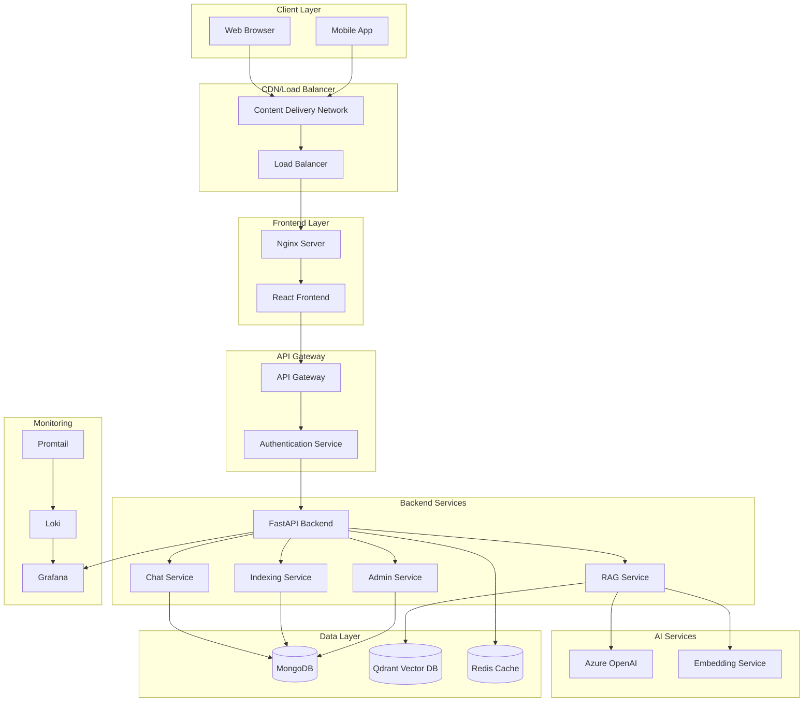
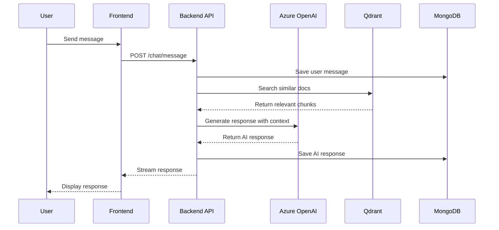
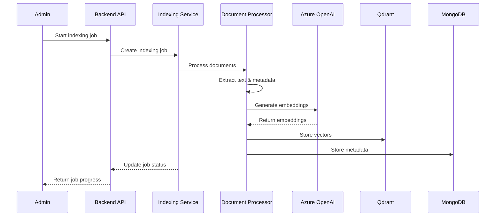
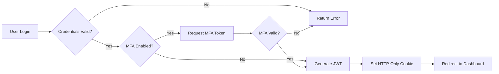
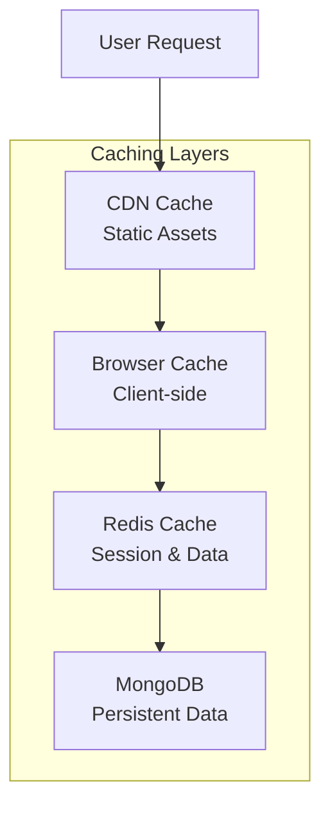
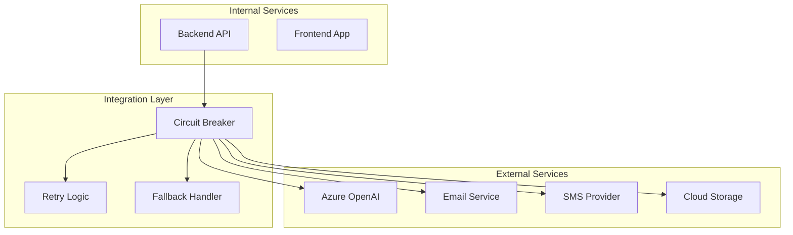
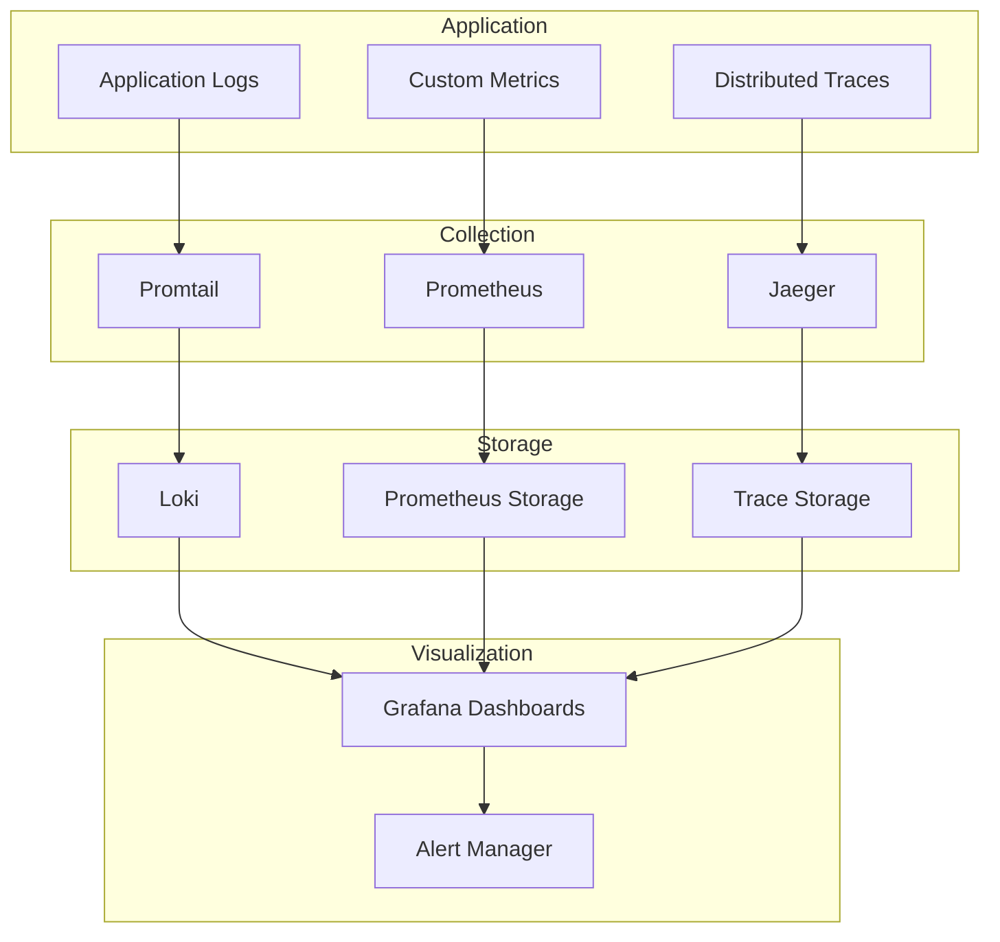
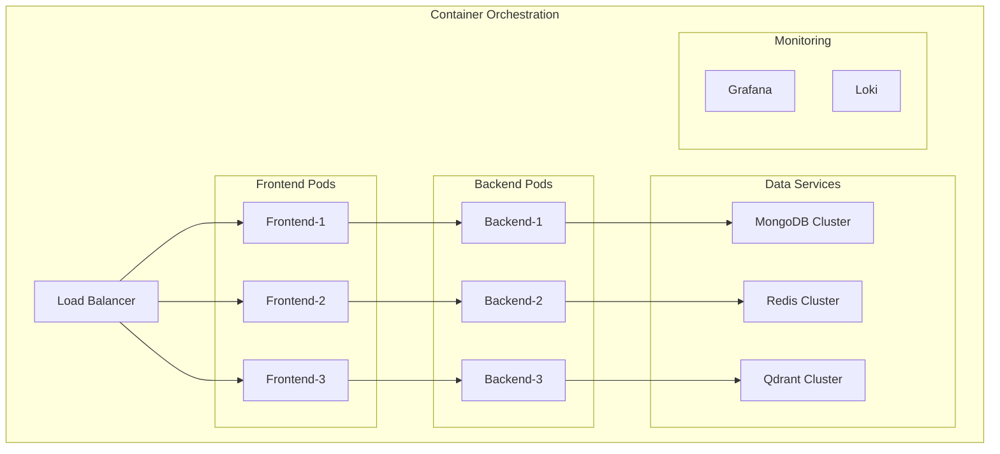

# 🏗️ ARCHITETTURA DEL SISTEMA

## 📋 Overview Architetturale

Documentazione completa dell'architettura del portale web aziendale full-stack, includendo pattern architetturali, componenti principali, flussi di dati e decisioni tecniche.

## 🎯 Principi Architetturali

### Scalabilità
- **Microservices-ready**: Architettura modulare facilmente scalabile
- **Horizontal Scaling**: Support per load balancing e clustering
- **Caching Strategy**: Multi-layer caching (Redis, browser, CDN)
- **Database Sharding**: Preparato per partitioning MongoDB

### Resilienza
- **Fault Tolerance**: Graceful degradation e circuit breakers
- **Health Checks**: Monitoring continuo stato servizi
- **Backup Strategy**: Automated backup e disaster recovery
- **Rollback Capability**: Zero-downtime deployment con rollback

### Sicurezza
- **Defense in Depth**: Multiple layer di sicurezza
- **Zero Trust**: Verificazione continua identità e autorizzazioni
- **Data Encryption**: Encryption at rest e in transit
- **Audit Trail**: Logging completo per compliance

## 🔧 Architettura Tecnica

### High-Level Architecture



### Component Architecture

#### Frontend Architecture
```
src/
├── components/
│   ├── ui/              # Reusable UI components (Fluent UI)
│   ├── chat/            # Chat-specific components
│   ├── admin/           # Admin panel components
│   ├── auth/            # Authentication components
│   └── shared/          # Shared business components
├── hooks/               # Custom React hooks
├── store/               # State management (Zustand)
├── services/            # API services e HTTP clients
├── utils/               # Utility functions
├── types/               # TypeScript type definitions
└── contexts/            # React contexts
```

#### Backend Architecture
```
backend/
├── app/
│   ├── api/             # FastAPI routes
│   │   ├── auth/        # Authentication endpoints
│   │   ├── chat/        # Chat endpoints
│   │   ├── admin/       # Admin endpoints
│   │   └── health/      # Health check endpoints
│   ├── core/            # Core functionality
│   │   ├── database.py  # Database connections
│   │   ├── security.py  # Security utilities
│   │   └── config.py    # Configuration management
│   ├── models/          # Pydantic models
│   ├── services/        # Business logic services
│   │   ├── chat_service.py
│   │   ├── rag_service.py
│   │   ├── auth_service.py
│   │   └── admin_service.py
│   ├── middleware/      # Custom middleware
│   └── utils/           # Utility functions
├── tests/               # Test suite
└── alembic/             # Database migrations (if needed)
```

## 🔄 Data Flow Architecture

### Chat Flow


### Indexing Flow


## 🗃️ Database Design

### MongoDB Collections

#### Users Collection
```json
{
  "_id": "ObjectId",
  "email": "string",
  "username": "string", 
  "full_name": "string",
  "hashed_password": "string",
  "role": "admin|user|viewer",
  "is_active": "boolean",
  "is_verified": "boolean",
  "mfa_enabled": "boolean",
  "mfa_secret": "string",
  "created_at": "datetime",
  "updated_at": "datetime"
}
```

#### Chat Sessions Collection
```json
{
  "_id": "ObjectId",
  "user_id": "ObjectId",
  "title": "string",
  "message_count": "number",
  "created_at": "datetime",
  "updated_at": "datetime"
}
```

#### Chat Messages Collection
```json
{
  "_id": "ObjectId",
  "session_id": "ObjectId",
  "user_id": "ObjectId",
  "message": "string",
  "response": "string",
  "sources": "array",
  "metadata": "object",
  "created_at": "datetime"
}
```

### Qdrant Vector Store Schema
```python
{
  "id": "uuid",
  "vector": [float],  # 3072 dimensions for text-embedding-3-large
  "payload": {
    "text": "string",
    "document_id": "string",
    "file_path": "string",
    "chunk_index": "number",
    "metadata": "object"
  }
}
```

## 🔐 Security Architecture

### Authentication Flow


### Authorization Layers
1. **Network Level**: Firewall e VPN access
2. **Application Level**: JWT validation
3. **API Level**: Endpoint-specific permissions
4. **Resource Level**: Ownership e role-based access
5. **Data Level**: Row-level security policies

## 📊 Performance Architecture

### Caching Strategy


### Scaling Strategy
- **Frontend**: CDN + horizontal scaling with load balancer
- **Backend**: Horizontal scaling con container orchestration
- **Database**: Read replicas + potential sharding
- **Vector Store**: Qdrant clustering per large datasets
- **Cache**: Redis cluster con replication

## 🔄 Integration Architecture

### External Services Integration


## 📈 Monitoring Architecture

### Observability Stack


## 🏢 Deployment Architecture

### Container Architecture


## 📝 Decision Records

### Technology Choices

**Frontend Framework: React + TypeScript**
- **Reason**: Mature ecosystem, strong typing, community support
- **Alternatives**: Vue.js, Angular
- **Trade-offs**: Learning curve vs developer productivity

**Backend Framework: FastAPI**
- **Reason**: Automatic API docs, async support, Python ecosystem
- **Alternatives**: Django, Flask, Node.js
- **Trade-offs**: Python performance vs development speed

**Database: MongoDB + Qdrant**
- **Reason**: Document flexibility + vector search capabilities
- **Alternatives**: PostgreSQL + pgvector
- **Trade-offs**: ACID compliance vs scalability

**UI Library: Microsoft Fluent UI**
- **Reason**: Enterprise design system, accessibility
- **Alternatives**: Material-UI, Ant Design
- **Trade-offs**: Customization vs consistency

---

*📅 Ultimo aggiornamento: [Data]*  
*👤 Responsabile: Solutions Architect Team* 