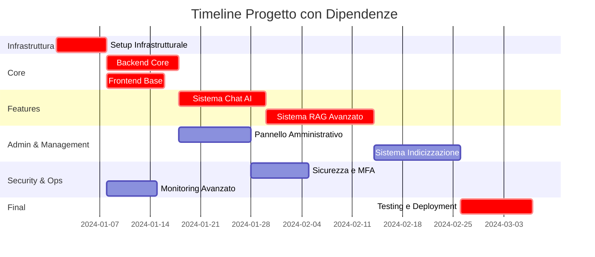
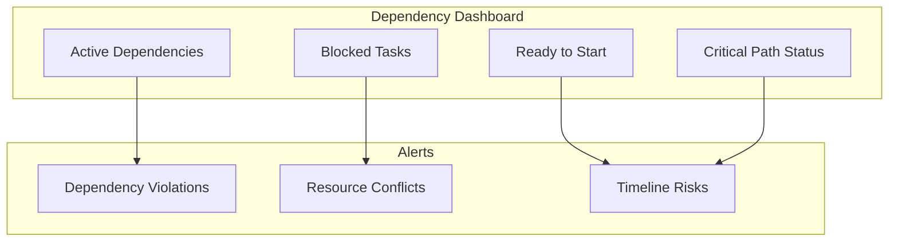

# 🔗 DIPENDENZE TRA FASI

## 📋 Overview Dipendenze

Analisi dettagliata delle dipendenze tra le fasi del progetto, path critico, possibili parallelizzazioni e gestione dei rischi di blocking.

## 🎯 Matrice Dipendenze

### Dipendenze Dirette

| Fase | Dipende da | Tipo Dipendenza | Criticità |
|------|------------|-----------------|-----------|
| 02 - Backend Core | 01 - Setup Infrastrutturale | **BLOCCA** | ⭐⭐⭐ |
| 03 - Frontend Base | 01 - Setup Infrastrutturale | **BLOCCA** | ⭐⭐⭐ |
| 04 - Sistema Chat AI | 02 - Backend Core, 03 - Frontend Base | **BLOCCA** | ⭐⭐⭐ |
| 05 - Sistema RAG | 02 - Backend Core, 04 - Sistema Chat AI | **BLOCCA** | ⭐⭐⭐ |
| 06 - Pannello Admin | 02 - Backend Core, 03 - Frontend Base | **PARZIALE** | ⭐⭐ |
| 07 - Sistema Indicizzazione | 05 - Sistema RAG, 06 - Pannello Admin | **PARZIALE** | ⭐⭐ |
| 08 - Sicurezza MFA | 02 - Backend Core, 06 - Pannello Admin | **PARZIALE** | ⭐⭐ |
| 09 - Monitoring | 01 - Setup Infrastrutturale | **PARZIALE** | ⭐ |
| 10 - Testing & Deployment | Tutte le fasi precedenti | **BLOCCA** | ⭐⭐⭐ |

### Legenda Dipendenze
- **BLOCCA**: La fase non può iniziare senza il completamento della dipendenza
- **PARZIALE**: La fase può iniziare con completamento parziale della dipendenza
- **SOFT**: La fase può procedere ma beneficia del completamento della dipendenza

## 📊 Diagramma Gantt delle Dipendenze



## 🔄 Path Critico

### Path Principale (78 giorni)
```
01 → 02 → 04 → 05 → 07 → 10
Infrastruttura → Backend → Chat → RAG → Indicizzazione → Deployment
```

### Path Secondari
```
01 → 03 → 06 → 08
Infrastruttura → Frontend → Admin → Sicurezza

01 → 09
Infrastruttura → Monitoring
```

## ⚡ Opportunità di Parallelizzazione

### Fase 1: Dopo Setup Infrastrutturale
**Parallel Tracks:**
- **Track A**: Backend Core (10 giorni)
- **Track B**: Frontend Base (8 giorni)
- **Track C**: Monitoring Avanzato (7 giorni)

**Benefit**: Risparmio di 10 giorni

### Fase 2: Dopo Backend + Frontend
**Parallel Tracks:**
- **Track A**: Sistema Chat AI (12 giorni)
- **Track B**: Pannello Amministrativo (10 giorni)

**Benefit**: Risparmio di 2 giorni

### Fase 3: Features Avanzate
**Parallel Tracks:**
- **Track A**: Sistema Indicizzazione (12 giorni)
- **Track B**: Sicurezza e MFA (8 giorni)

**Benefit**: Risparmio di 4 giorni

## 📈 Timeline Ottimizzata

| Settimana | Track A | Track B | Track C |
|-----------|---------|---------|---------|
| 1 | 🔧 Setup Infrastrutturale | - | - |
| 2-3 | 🔙 Backend Core | 🔲 Frontend Base | 📊 Monitoring |
| 4-5 | 💬 Sistema Chat AI | 🛠️ Pannello Admin | - |
| 6-8 | 🧠 Sistema RAG Avanzato | - | - |
| 9-10 | 📚 Sistema Indicizzazione | 🔐 Sicurezza MFA | - |
| 11-12 | 🚀 Testing & Deployment | - | - |

**Timeline Ottimizzata**: ~12 settimane (vs 15-20 originali)

## ⚠️ Gestione Rischi Dipendenze

### Rischi Alto Impatto

#### 1. Blocco Azure OpenAI Setup
**Impatto**: Blocca fasi 04, 05, 07
**Mitigazione**: 
- Setup account Azure prioritario nella Fase 01
- Fallback su OpenAI API pubbliche
- Mock services per development parallelo

#### 2. Problemi Database Setup
**Impatto**: Blocca tutte le fasi backend
**Mitigazione**:
- MongoDB Atlas come backup
- Docker local dev environment
- Database schema design early validation

#### 3. Frontend Framework Issues
**Impatto**: Ritarda fasi 03, 04, 06, 08
**Mitigazione**:
- Prototype iniziale con stack semplificato
- Component library evaluation early
- Parallel API development

### Strategie Contingency

#### Plan B: Riduzione Scope
1. **Chat Semplificato**: Senza RAG inizialmente
2. **Admin Basico**: Solo user management
3. **Indicizzazione Manuale**: Senza automation

#### Plan C: Phased Delivery
1. **MVP Release**: Chat + Auth + Basic Admin
2. **Phase 2**: RAG + Advanced Features
3. **Phase 3**: Full Automation + Advanced Security

## 🔄 Milestone e Checkpoint

### Milestone Critici

#### M1: Infrastruttura Ready (Settimana 1)
- ✅ Docker environment funzionante
- ✅ Database connections attive
- ✅ Azure OpenAI account configurato

#### M2: Core Platform (Settimana 3)
- ✅ Backend API foundation
- ✅ Frontend base navigation
- ✅ Authentication flow

#### M3: Chat MVP (Settimana 5)
- ✅ Basic chat functionality
- ✅ User management
- ✅ Session persistence

#### M4: AI Integration (Settimana 8)
- ✅ RAG pipeline operativo
- ✅ Document indexing
- ✅ Advanced chat features

#### M5: Production Ready (Settimana 12)
- ✅ Security hardening
- ✅ Monitoring active
- ✅ Deployment automated

### Checkpoint Reviews

#### Weekly Reviews
- **Lunedì**: Progress review e blockers identification
- **Mercoledì**: Technical deep-dive e problem solving
- **Venerdì**: Week wrap-up e next week planning

#### Bi-weekly Stakeholder Reviews
- Demo delle funzionalità completate
- Review dei rischi e mitigazioni
- Alignment su priority changes

## 📊 Metriche Dipendenze

### KPI Tracking
- **Dependency Resolution Time**: Tempo medio risoluzione blockers
- **Parallel Efficiency**: % di lavoro parallelizzato vs sequenziale
- **Critical Path Variance**: Deviazioni dal path critico
- **Resource Utilization**: % utilizzo team durante parallelizzazioni

### Dashboard Dipendenze


## 🛠️ Tools Gestione Dipendenze

### Project Management
- **Jira/Azure DevOps**: Task tracking con dependencies
- **Microsoft Project**: Gantt charts e critical path
- **Notion/Confluence**: Documentation e decision tracking

### Communication
- **Slack/Teams**: Real-time coordination
- **Daily Standups**: Dependency status updates
- **Dependency Board**: Visual tracking blockers

---

*📅 Ultimo aggiornamento: [Data]*  
*👤 Responsabile: Project Management Office* 